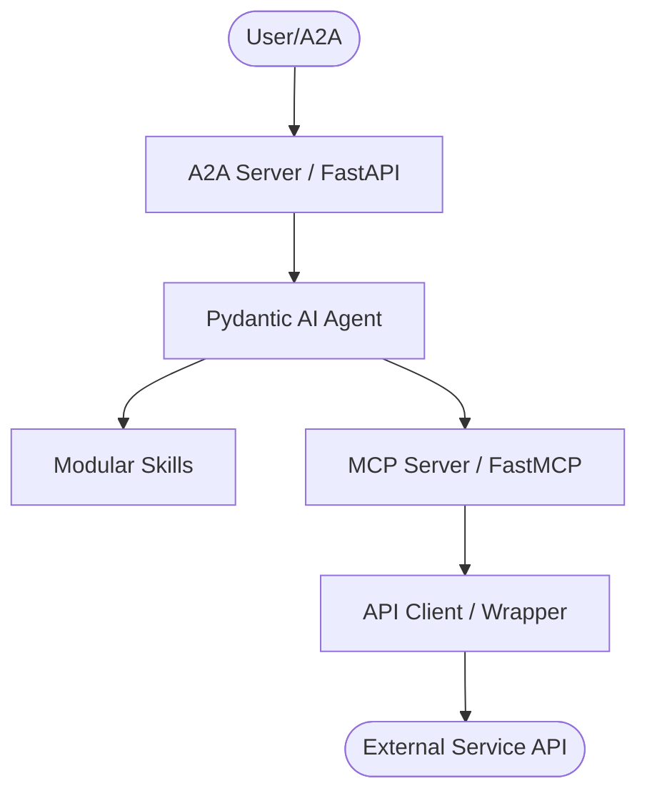
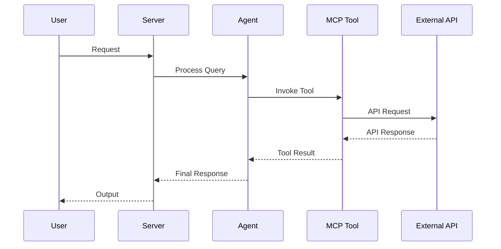

# AGENTS.md

> Claude Code loads this file via `CLAUDE.md` (`@AGENTS.md` import) — the two stay
> in sync. Edit **this** file, not `CLAUDE.md`.

## Tech Stack & Architecture
- Language/Version: Python 3.10+
- Core Libraries: `agent-utilities`, `fastmcp`, `pydantic-ai`
- Key principles: Functional patterns, Pydantic for data validation, asynchronous tool execution.
- Architecture:
    - `mcp_server.py`: Main MCP server entry point and tool registration.
    - `agent.py`: Pydantic AI agent definition and logic.
    - `skills/`: Directory containing modular agent skills (if applicable).

### Architecture Diagram


### Workflow Diagram


## Commands (run these exactly)
# Installation
pip install .[all]

# Quality & Linting (run from project root)
pre-commit run --all-files

# Execution Commands
# gitlab-mcp
gitlab_api.mcp_server:mcp_server
# gitlab-agent
gitlab_api.agent_server:agent_server

## Project Structure Quick Reference
- MCP Entry Point → `mcp_server.py`
- Agent Entry Point → `agent_server.py`
- Source Code → `gitlab_api/`
- Skills → `skills/` (if exists)

### File Tree
```text
├── .github/
│   └── workflows/
│       ├── docs.yml
│       ├── pages.yml
│       └── pipeline.yml
├── .specify/
│   └── specs/
│       ├── code-enhancement-20260512/
│       │   ├── CHECKLIST.md
│       │   ├── DRIFT_REPORT.md
│       │   ├── spec.json
│       │   ├── spec.md
│       │   ├── tasks.json
│       │   └── tasks.md
│       └── code-enhancement-20260524/
│           ├── spec.json
│           ├── spec.md
│           ├── tasks.json
│           └── tasks.md
├── docker/
│   ├── agent.compose.yml
│   ├── debug.Dockerfile
│   ├── Dockerfile
│   ├── mcp.compose.yml
│   └── starship.toml
├── docs/
│   ├── concepts.md
│   ├── deployment.md
│   ├── index.md
│   ├── installation.md
│   ├── overview.md
│   ├── platform.md
│   └── usage.md
├── gitlab_api/
│   ├── api/
│   │   ├── __init__.py
│   │   ├── api_client_base.py
│   │   ├── api_client_environments.py
│   │   ├── api_client_issues.py
│   │   ├── api_client_merge_requests.py
│   │   ├── api_client_other.py
│   │   ├── api_client_pipelines.py
│   │   ├── api_client_projects.py
│   │   ├── api_client_repositories.py
│   │   ├── api_client_system.py
│   │   └── api_client_users_groups.py
│   ├── mcp/
│   │   ├── __init__.py
│   │   ├── mcp_branches.py
│   │   ├── mcp_commits.py
│   │   ├── mcp_custom_api.py
│   │   ├── mcp_deploy_tokens.py
│   │   ├── mcp_environments.py
│   │   ├── mcp_epics.py
│   │   ├── mcp_graphql.py
│   │   ├── mcp_groups.py
│   │   ├── mcp_issues.py
│   │   ├── mcp_jobs.py
│   │   ├── mcp_labels.py
│   │   ├── mcp_members.py
│   │   ├── mcp_merge_requests.py
│   │   ├── mcp_merge_rules.py
│   │   ├── mcp_milestones.py
│   │   ├── mcp_misc.py
│   │   ├── mcp_notes.py
│   │   ├── mcp_packages.py
│   │   ├── mcp_pipeline_schedules.py
│   │   ├── mcp_pipelines.py
│   │   ├── mcp_projects.py
│   │   ├── mcp_protected_branches.py
│   │   ├── mcp_releases.py
│   │   ├── mcp_runners.py
│   │   ├── mcp_snippets.py
│   │   └── mcp_tags.py
│   ├── __init__.py
│   ├── __main__.py
│   ├── agent_server.py
│   ├── api_client.py
│   ├── auth.py
│   ├── gitlab_gql.py
│   ├── gitlab_input_models.py
│   ├── gitlab_response_models.py
│   ├── main_agent.json
│   ├── mcp_config.json
│   └── mcp_server.py
├── scripts/
│   ├── security_sanitizer.py
│   ├── validate_a2a_agent.py
│   ├── validate_agent.py
│   └── verify_api_integration.py
├── tests/
│   ├── __init__.py
│   ├── conftest.py
│   ├── test_api_wrapper.py
│   ├── test_auth.py
│   ├── test_concept_parity.py
│   ├── test_gitlab_a2a_validation.py
│   ├── test_gitlab_api_brute_force_coverage.py
│   ├── test_gitlab_gql.py
│   ├── test_gitlab_mcp_validation.py
│   ├── test_gitlab_models.py
│   ├── test_init_dynamics.py
│   ├── test_mock_coverage.py
│   ├── test_startup.py
│   ├── test_verify_agent.py
│   └── verify_a2a_queries.py
├── .bumpversion.cfg
├── .codespellignore
├── .dockerignore
├── .env.example
├── .gitattributes
├── .gitignore
├── .pre-commit-config.yaml
├── .vulture_ignore
├── a2a.json
├── AGENTS.md
├── CHANGELOG.md
├── CLAUDE.md
├── LICENSE
├── MANIFEST.in
├── mcp_config.json
├── mkdocs.yml
├── opencode.json
├── pyproject.toml
├── pytest.ini
├── README.md
├── requirements.txt
└── uv.lock
```

## Code Style & Conventions
**Always:**
- Use `agent-utilities` for common patterns (e.g., `create_mcp_server`, `create_agent`).
- Define input/output models using Pydantic.
- Include descriptive docstrings for all tools (they are used as tool descriptions for LLMs).
- Check for optional dependencies using `try/except ImportError`.

**Good example:**
```python
from agent_utilities import create_mcp_server
from mcp.server.fastmcp import FastMCP

mcp = create_mcp_server("my-agent")

@mcp.tool()
async def my_tool(param: str) -> str:
    """Description for LLM."""
    return f"Result: {param}"
```

## Dos and Don'ts
**Do:**
- Run `pre-commit` before pushing changes.
- Use existing patterns from `agent-utilities`.
- Keep tools focused and idempotent where possible.

**Don't:**
- Use `cd` commands in scripts; use absolute paths or relative to project root.
- Add new dependencies to `dependencies` in `pyproject.toml` without checking `optional-dependencies` first.
- Hardcode secrets; use environment variables or `.env` files.

## Safety & Boundaries
**Always do:**
- Run lint/test via `pre-commit`.
- Use `agent-utilities` base classes.

**Ask first:**
- Major refactors of `mcp_server.py` or `agent.py`.
- Deleting or renaming public tool functions.

**Never do:**
- Commit `.env` files or secrets.
- Modify `agent-utilities` or `universal-skills` files from within this package.

## When Stuck
- Propose a plan first before making large changes.
- Check `agent-utilities` documentation for existing helpers.

## ⛔ No Scratch or Temporary Files in Repository

**NEVER write any of the following to this repository:**
- Temporary test scripts (`test_*.py`, `debug_*.py` outside of `tests/`)
- Scratch scripts or experimental one-off files
- Log files (`.log`, `.txt` command output)
- Random text files with command output or debug dumps
- Any file that is NOT production source code, tests in `tests/`, or documentation

**Why:** These files expose private filesystem paths, credentials, and internal infrastructure details when pushed to GitHub publicly.

**Where to put scratch work instead:**
- Use `~/workspace/scratch/` for temporary scripts and experiments
- Use `~/workspace/reports/` for command output and reports
- Keep test scripts in the `tests/` directory following proper pytest conventions

## ⛔ Keep the Repository Root Pristine — No Scratch / Temp / Debug Files

**The repository ROOT must contain only canonical project files** (packaging,
config, docs, lockfiles). The only hidden directories allowed at root are
`.git/`, `.github/`, and `.specify/` (plus a local, git-ignored `.venv/`).

**NEVER write any of the following — anywhere in the repo, and ESPECIALLY at the root:**
- One-off / debug / migration scripts: `fix_*.py`, `migrate_*.py`, `refactor_*.py`,
  `replace_*.py`, `update_*.py`, `debug_*.py`, or `test_*.py` **at the root**
  (real tests live in `tests/` only).
- Databases / data dumps: `*.db`, `*.db-wal`, `*.sqlite*`, `*.corrupted`.
- Logs / command output: `*.log`, scratch `*.txt`, `*.orig`, `*.rej`, `*.bak`.
- Build artifacts: `*.tsbuildinfo`, compiled binaries, coverage files.
- AI agent scratch directories: `.agent/`, `.agents/`, `.agent_data/`, `.tmp/`,
  `.hypothesis/`, or any per-tool cache committed to git.
- Any file that is NOT production source, a test in `tests/`, documentation, or
  a recognized config/lockfile.

**Why:** scratch at the root leaks private paths/credentials, bloats the tree,
and erodes a pristine codebase.

**Where scratch goes instead:** `~/workspace/scratch/` (experiments),
`~/workspace/reports/` (command output); tests go in `tests/` (pytest).
Before finishing a task, run `git status` and confirm no stray root files were added.

## Working Discipline — think, simplify, stay surgical, verify

These four habits cut the most common LLM coding mistakes. For trivial tasks, use
judgment; the bias here is correctness over speed.

- **Think before coding.** State your assumptions explicitly. If a request has more than
  one reasonable reading, surface the options instead of silently picking one. If a
  simpler approach exists, say so and push back when warranted. When something is
  genuinely unclear, stop and name what's confusing — ask, don't guess.
- **Simplicity first.** Write the minimum code that solves the stated problem — no
  speculative features, no abstraction for single-use code, no configurability that
  wasn't requested, no error handling for impossible states. If you wrote 200 lines and
  it could be 50, rewrite it. (Name code from its purpose, never `wave0`/`phase2`/`v2`.)
- **Stay surgical.** Every changed line should trace directly to the task. Don't refactor,
  reformat, or "improve" working code adjacent to your change; match the existing style
  even where you'd do it differently. Remove only the imports/symbols your own change
  orphaned; if you spot unrelated dead code, mention it rather than deleting it inline.
  *Exception — the Quality Bar below:* lint/format/type errors the pre-commit gate flags
  get fixed regardless of who introduced them. In short: **surgical on behavior, clean on
  lint.**
- **Verify against a goal.** Turn the task into a checkable outcome before you start:
  "fix the bug" → "write a failing test that reproduces it, then make it pass"; "add
  validation" → "tests for the invalid inputs pass". For multi-step work, state the short
  plan and the check for each step, then loop until the checks pass.

## Quality Bar — Leave the Codebase Clean (REQUIRED)

After completing any code change, run the project's pre-commit suite and drive it
**fully green** before committing:

```bash
pre-commit run --all-files
```

Resolve **every** issue it reports — failures, lint errors, type errors, and
warnings — **including problems that pre-date your change and were not caused by
your edits**. The standing goal is a clean, working codebase with **no errors and
no warnings**. Do not silence checks (`# noqa`, `# type: ignore`, `SKIP=`,
`--no-verify`) to force green unless the exception is already documented in this
file as a known, unavoidable limitation. Only commit once `pre-commit run
--all-files` passes cleanly; if a check legitimately cannot pass, stop and explain
why rather than bypassing it.

## Working with Git Worktrees (multi-session)

Multiple agents/sessions work the `agent-packages/*` repos concurrently. **Do not
edit the canonical checkout** (`${WORKSPACE_ROOT}/agent-packages/<repo>`) — a
background `repository-manager` sync can reset its working tree and discard
uncommitted edits. Take your own git worktree on your own branch instead:

```bash
# preferred — repository-manager MCP:
rm_worktree add <repo> <your-branch>      # -> ${WORKTREE_ROOT}/<repo>/<your-branch>

# raw-git fallback:
git -C agent-packages/<repo> checkout main
git -C agent-packages/<repo> worktree add ${WORKTREE_ROOT}/<repo>/<branch> -b <branch>
```

Work in the worktree and **commit often** (commits survive a working-tree reset).
Each session must use a **distinct branch** — git allows a branch in only one
worktree, which is what keeps concurrent sessions from colliding. Worktrees live
under `${WORKTREE_ROOT}/` (outside the workspace scan, so the sync leaves them
alone).

**Finishing work in a worktree** — run this sequence before calling it done:
1. **Pre-commit green** — `pre-commit run --all-files`; resolve every issue per the
   Quality Bar above (including pre-existing), no `--no-verify`.
2. **Commit** in the worktree.
3. **Merge to main locally** — `rm_worktree merge <repo> <branch> --into main`
   (or `git merge --no-ff`). Push only when the user asks.
4. **Clean up** — remove the worktree and delete the merged branch:
   `rm_worktree remove <repo> <branch> --delete-branch`; `rm_worktree prune` clears
   stale entries. (Raw-git: `git worktree remove <path> && git branch -d <branch>`.)

<!-- BEGIN concept-coordination (generated) -->
## Concept-ID Coordination (multi-session)

Working in parallel with other sessions/worktrees? **Reserve a concept id before you write its `CONCEPT:` marker** so two sessions never collide:

```bash
agent-utilities --json concept reserve --ns EG-KG.compute.backend   # or a package prefix, e.g. KEY
```

Full protocol (ledger, merge=union, reconcile, MCP/REST): <https://knuckles-team.github.io/agent-utilities/concept_coordination/>
<!-- END concept-coordination (generated) -->

## Version & lockfile drift edict (keep the version mirrors AND the lock in sync)

The two most common release-breakers in this fleet are **version drift** (the version in
`pyproject.toml`/`.bumpversion.cfg` advancing while `README.md`, `docker/Dockerfile`, and the
module `__version__`s lag) and a **stale `uv.lock`** (shipping known-vulnerable transitive deps).
A version mismatch makes the next `bump-my-version` throw `VersionNotFoundException`; a stale lock
is what Dependabot flags. Rules:

1. **Never hand-edit a version string.** Change the version ONLY via
   `bump-my-version bump {patch|minor|major}` (a.k.a. `bump2version`), which rewrites every file
   registered in `.bumpversion.cfg` in one atomic, tagged commit. If you edited the version in
   `pyproject.toml` by hand, you created drift — revert and use the bumper.
2. **Every version-bearing file must be registered in `.bumpversion.cfg`** — at minimum
   `pyproject.toml` AND `README.md`, plus `docker/Dockerfile` and any module `__version__`. Never
   add a file that embeds the version without a `[bumpversion:file:...]` entry for it.
3. **Re-lock on every dependency change.** After editing `pyproject.toml` deps/extras, run
   `uv lock` and commit `uv.lock` in the SAME change. The `uv-lock` pre-commit hook runs with
   `--locked` and fails on drift — never bypass it. The committed `uv.lock` is the
   Dependabot/security surface.
4. **Patch CVEs with a version floor at the source, then re-lock.** `uv` resolves one version
   graph-wide, so a lower-bound in the extra that pulls a dependency raises it for the whole lock.
