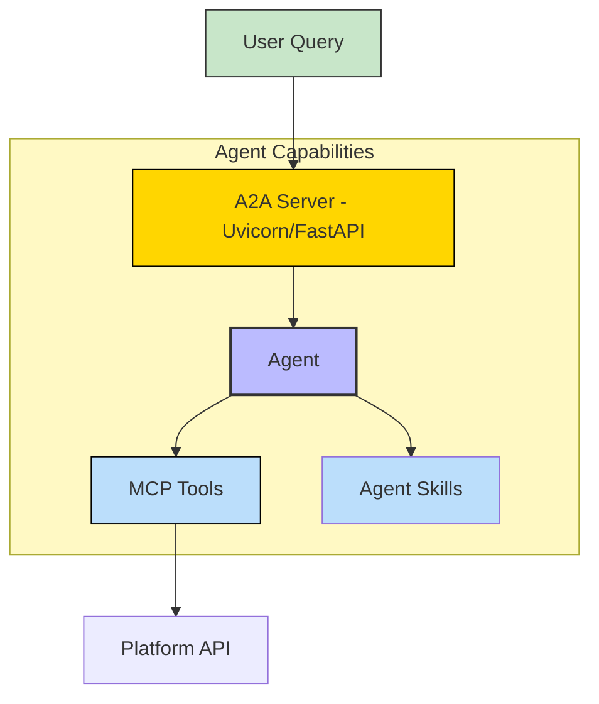
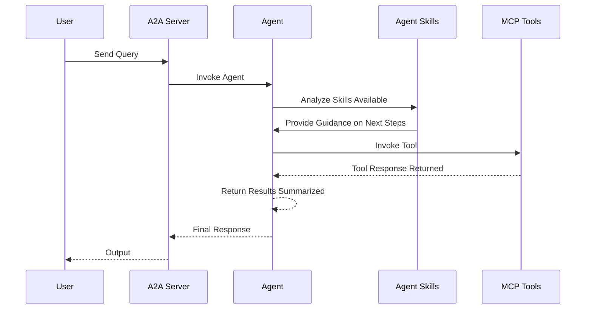

# GitLab API - A2A | AG-UI | MCP


*Version: 25.14.16*

## Overview

This project started out as a python wrapper for GitLab, but since the dawn of standards like
Model Context Protocol (MCP) and Agent2Agent (A2A) Agent,
this repository has become a sandbox for some brand new and pretty cool features with respects to each of those.
The original APIs should remain stable,
but please note, the latest features like A2A may still be unstable as it is under active development.

This project now includes an MCP server, which wraps all the original APIs you know and love in the base project. This
allows any MCP capable LLM to leverage these tools and interact with GitLab. The MCP Server is enhanced with
various authentication mechanisms, middleware for observability and control,
and optional Eunomia authorization for policy-based access control.

GitLab A2A implements a multi-agent system designed to manage and interact with GitLab tasks through a delegated,
specialist-based architecture. Built using Python, it leverages libraries like `pydantic-ai` for agent creation,
`FastMCPToolset` for integrating Model Context Protocol (MCP) tools, and `Graphiti`
for building a temporal knowledge graph from official GitLab documentation.
The system runs as a FastAPI server via Uvicorn, exposing an Agent-to-Agent (A2A) interface for handling requests.
`pydantic-ai` is able to expose your agent as an A2A agent out of the box with `.to_a2a()`.
This allows this agent to be integrated in
any agentic framework like `Microsoft Agent Framework` (MAF) or `crew.ai`.
The core idea is an orchestrator agent that analyzes user queries and delegates subtasks to specialized child agents,
each focused on a specific domain (e.g., merge requests, pipelines).
Child agents have access to filtered MCP tools and a shared knowledge graph for reasoning over documentation,
ensuring accurate and context-aware executions without direct access to the underlying APIs from the orchestrator.

This architecture promotes modularity, scalability, and maintainability, making it suitable for enterprise
integrations with platforms like GitLab.

Contributions are welcome!

## API

### API Calls
- [Branches](https://docs.gitlab.com/api/branches)
- [Commits](https://docs.gitlab.com/api/commits)
- [Deploy Tokens](https://docs.gitlab.com/api/deploy_tokens)
- [Groups](https://docs.gitlab.com/api/groups)
- [Jobs](https://docs.gitlab.com/api/jobs)
- [Members](https://docs.gitlab.com/api/members)
- [Merge Request](https://docs.gitlab.com/api/merge_requests)
- [Merge Request Rules](https://docs.gitlab.com/api/merge_request_approvals)
- [Merge Request Rule Settings](https://docs.gitlab.com/api/merge_request_approval_settings)
- [Namespaces](https://docs.gitlab.com/api/namespaces)
- [Packages](https://docs.gitlab.com/api/packages)
- [Pipeline](https://docs.gitlab.com/api/pipelines)
- [Pipeline Schedules](https://docs.gitlab.com/api/pipeline_schedules)
- [Projects](https://docs.gitlab.com/api/projects)
- [Protected Branches](https://docs.gitlab.com/api/protected_branches)
- [Releases](https://docs.gitlab.com/api/releases)
- [Runners](https://docs.gitlab.com/api/runners)
- [Users](https://docs.gitlab.com/api/users)
- [Wiki](https://docs.gitlab.com/api/wikis)
- [Environments](https://docs.gitlab.com/api/environments)
- [Protected Environments](https://docs.gitlab.com/api/protected_environments)
- [Tags](https://docs.gitlab.com/api/tags)
- [Protected Tags](https://docs.gitlab.com/api/protected_tags)
- [Custom Endpoint](https://docs.gitlab.com/api/api_resources)

If your API call isn't supported, you can always run the standard custom API endpoint function to get/post/put/delete and endpoint

### Experimental - GraphQL:
- Branches
- Groups
- Jobs
- Merge Request
- Pipeline
- Branches
- Users
- Wiki
- Projects

## MCP

All the available API Calls above are wrapped in MCP Tools. You can find those below with their tool descriptions and associated tag.

### MCP Tools

| Function Name                                  | Description                                                                                                        | Tag(s)             |
|------------------------------------------------|--------------------------------------------------------------------------------------------------------------------|--------------------|
| get_branches                                   | Get branches in a GitLab project, optionally filtered.                                                             | branches           |
| create_branch                                  | Create a new branch in a GitLab project from a reference.                                                          | branches           |
| delete_branch                                  | Delete a branch or all merged branches in a GitLab project.                                                        | branches           |
| get_commits                                    | Get commits in a GitLab project, optionally filtered.                                                              | commits            |
| create_commit                                  | Create a new commit in a GitLab project.                                                                           | commits            |
| get_commit_diff                                | Get the diff of a specific commit in a GitLab project.                                                             | commits            |
| revert_commit                                  | Revert a commit in a target branch in a GitLab project.                                                            | commits            |
| get_commit_comments                            | Retrieve comments on a specific commit in a GitLab project.                                                        | commits            |
| create_commit_comment                          | Create a new comment on a specific commit in a GitLab project.                                                     | commits            |
| get_commit_discussions                         | Retrieve discussions (threaded comments) on a specific commit in a GitLab project.                                 | commits            |
| get_commit_statuses                            | Retrieve build/CI statuses for a specific commit in a GitLab project.                                              | commits            |
| post_build_status_to_commit                    | Post a build/CI status to a specific commit in a GitLab project.                                                   | commits            |
| get_commit_merge_requests                      | Retrieve merge requests associated with a specific commit in a GitLab project.                                     | commits            |
| get_commit_gpg_signature                       | Retrieve the GPG signature for a specific commit in a GitLab project.                                              | commits            |
| get_deploy_tokens                              | Retrieve a list of all deploy tokens for the GitLab instance.                                                      | deploy_tokens      |
| get_project_deploy_tokens                      | Retrieve a list of deploy tokens for a specific GitLab project.                                                    | deploy_tokens      |
| create_project_deploy_token                    | Create a deploy token for a GitLab project with specified name and scopes.                                         | deploy_tokens      |
| delete_project_deploy_token                    | Delete a specific deploy token for a GitLab project.                                                               | deploy_tokens      |
| get_group_deploy_tokens                        | Retrieve deploy tokens for a GitLab group (list or single by ID).                                                  | deploy_tokens      |
| create_group_deploy_token                      | Create a deploy token for a GitLab group with specified name and scopes.                                           | deploy_tokens      |
| delete_group_deploy_token                      | Delete a specific deploy token for a GitLab group.                                                                 | deploy_tokens      |
| get_environments                               | Retrieve a list of environments for a GitLab project, optionally filtered or a single environment by id.           | environments       |
| create_environment                             | Create a new environment in a GitLab project with a specified name and optional external URL.                      | environments       |
| update_environment                             | Update an existing environment in a GitLab project with new name or external URL.                                  | environments       |
| delete_environment                             | Delete a specific environment in a GitLab project.                                                                 | environments       |
| stop_environment                               | Stop a specific environment in a GitLab project.                                                                   | environments       |
| stop_stale_environments                        | Stop stale environments in a GitLab project, optionally filtered by older_than timestamp.                          | environments       |
| delete_stopped_environments                    | Delete stopped review app environments in a GitLab project.                                                        | environments       |
| get_protected_environments                     | Retrieve protected environments in a GitLab project (list or single by name).                                      | environments       |
| protect_environment                            | Protect an environment in a GitLab project with optional approval count.                                           | environments       |
| update_protected_environment                   | Update a protected environment in a GitLab project with new approval count.                                        | environments       |
| unprotect_environment                          | Unprotect a specific environment in a GitLab project.                                                              | environments       |
| get_groups                                     | Retrieve a list of groups, optionally filtered or retrieve a single group by id.                                   | groups             |
| edit_group                                     | Edit a specific GitLab group's details (name, path, description, or visibility).                                   | groups             |
| get_group_subgroups                            | Retrieve a list of subgroups for a specific GitLab group, optionally filtered.                                     | groups             |
| get_group_descendant_groups                    | Retrieve a list of all descendant groups for a specific GitLab group, optionally filtered.                         | groups             |
| get_group_projects                             | Retrieve a list of projects associated with a specific GitLab group, optionally including subgroups.               | groups             |
| get_group_merge_requests                       | Retrieve a list of merge requests associated with a specific GitLab group, optionally filtered.                    | groups             |
| get_project_jobs                               | Retrieve a list of jobs for a specific GitLab project, optionally filtered or a single job by id.                  | jobs               |
| get_project_job_log                            | Retrieve the log (trace) of a specific job in a GitLab project.                                                    | jobs               |
| cancel_project_job                             | Cancel a specific job in a GitLab project.                                                                         | jobs               |
| retry_project_job                              | Retry a specific job in a GitLab project.                                                                          | jobs               |
| erase_project_job                              | Erase (delete artifacts and logs of) a specific job in a GitLab project.                                           | jobs               |
| run_project_job                                | Run (play) a specific manual job in a GitLab project.                                                              | jobs               |
| get_pipeline_jobs                              | Retrieve a list of jobs for a specific pipeline in a GitLab project, optionally filtered by scope.                 | jobs               |
| get_group_members                              | Retrieve a list of members in a specific GitLab group, optionally filtered by query or user IDs.                   | members            |
| get_project_members                            | Retrieve a list of members in a specific GitLab project, optionally filtered by query or user IDs.                 | members            |
| create_merge_request                           | Create a new merge request in a GitLab project with specified source and target branches.                          | merge_requests     |
| get_merge_requests                             | Retrieve a list of merge requests across all projects, optionally filtered by state, scope, or labels.             | merge_requests     |
| get_project_merge_requests                     | Retrieve a list of merge requests for a specific GitLab project, optionally filtered or a single merge request.    | merge_requests     |
| get_project_level_merge_request_approval_rules | Retrieve project-level merge request approval rules for a GitLab project.                                          | merge_rules        |
| create_project_level_rule                      | Create a new project-level merge request approval rule.                                                            | merge_rules        |
| update_project_level_rule                      | Update an existing project-level merge request approval rule.                                                      | merge_rules        |
| delete_project_level_rule                      | Delete a project-level merge request approval rule.                                                                | merge_rules        |
| merge_request_level_approvals                  | Retrieve approvals for a specific merge request in a GitLab project.                                               | merge_rules        |
| get_approval_state_merge_requests              | Retrieve the approval state of a specific merge request in a GitLab project.                                       | merge_rules        |
| get_merge_request_level_rules                  | Retrieve merge request-level approval rules for a specific merge request in a GitLab project.                      | merge_rules        |
| approve_merge_request                          | Approve a specific merge request in a GitLab project.                                                              | merge_rules        |
| unapprove_merge_request                        | Unapprove a specific merge request in a GitLab project.                                                            | merge_rules        |
| get_group_level_rule                           | Retrieve merge request approval settings for a specific GitLab group.                                              | merge_rules        |
| edit_group_level_rule                          | Edit merge request approval settings for a specific GitLab group.                                                  | merge_rules        |
| get_project_level_rule                         | Retrieve merge request approval settings for a specific GitLab project.                                            | merge_rules        |
| edit_project_level_rule                        | Edit merge request approval settings for a specific GitLab project.                                                | merge_rules        |
| get_repository_packages                        | Retrieve a list of repository packages for a specific GitLab project, optionally filtered by package type.         | packages           |
| publish_repository_package                     | Publish a repository package to a specific GitLab project.                                                         | packages           |
| download_repository_package                    | Download a repository package from a specific GitLab project.                                                      | packages           |
| get_pipelines                                  | Retrieve a list of pipelines for a specific GitLab project, optionally filtered or details of a specific pipeline. | pipelines          |
| run_pipeline                                   | Run a pipeline for a specific GitLab project with a given reference (e.g., branch or tag).                         | pipelines          |
| get_pipeline_schedules                         | Retrieve a list of pipeline schedules for a specific GitLab project.                                               | pipeline_schedules |
| get_pipeline_schedule                          | Retrieve details of a specific pipeline schedule in a GitLab project.                                              | pipeline_schedules |
| get_pipelines_triggered_from_schedule          | Retrieve pipelines triggered by a specific pipeline schedule in a GitLab project.                                  | pipeline_schedules |
| create_pipeline_schedule                       | Create a pipeline schedule for a specific GitLab project.                                                          | pipeline_schedules |
| edit_pipeline_schedule                         | Edit a pipeline schedule in a GitLab project.                                                                      | pipeline_schedules |
| take_pipeline_schedule_ownership               | Take ownership of a pipeline schedule in a GitLab project.                                                         | pipeline_schedules |
| delete_pipeline_schedule                       | Delete a pipeline schedule in a GitLab project.                                                                    | pipeline_schedules |
| run_pipeline_schedule                          | Run a pipeline schedule immediately in a GitLab project.                                                           | pipeline_schedules |
| create_pipeline_schedule_variable              | Create a variable for a pipeline schedule in a GitLab project.                                                     | pipeline_schedules |
| delete_pipeline_schedule_variable              | Delete a variable from a pipeline schedule in a GitLab project.                                                    | pipeline_schedules |
| get_projects                                   | Retrieve a list of projects, optionally filtered or details of a specific GitLab project.                          | projects           |
| get_nested_projects_by_group                   | Retrieve a list of nested projects within a GitLab group, including descendant groups.                             | projects           |
| get_project_contributors                       | Retrieve a list of contributors to a specific GitLab project.                                                      | projects           |
| get_project_statistics                         | Retrieve statistics for a specific GitLab project.                                                                 | projects           |
| edit_project                                   | Edit a specific GitLab project's details (name, description, or visibility).                                       | projects           |
| get_project_groups                             | Retrieve a list of groups associated with a specific GitLab project, optionally filtered.                          | projects           |
| archive_project                                | Archive a specific GitLab project.                                                                                 | projects           |
| unarchive_project                              | Unarchive a specific GitLab project.                                                                               | projects           |
| delete_project                                 | Delete a specific GitLab project.                                                                                  | projects           |
| share_project                                  | Share a specific GitLab project with a group, specifying access level.                                             | projects           |
| get_protected_branches                         | Retrieve a list of protected branches in a specific GitLab project or details of a specific protected branch.      | protected_branches |
| protect_branch                                 | Protect a specific branch in a GitLab project with specified access levels.                                        | protected_branches |
| unprotect_branch                               | Unprotect a specific branch in a GitLab project.                                                                   | protected_branches |
| require_code_owner_approvals_single_branch     | Require or disable code owner approvals for a specific branch in a GitLab project.                                 | protected_branches |
| get_releases                                   | Retrieve a list of releases for a specific GitLab project, optionally filtered.                                    | releases           |
| get_latest_release                             | Retrieve details of the latest release in a GitLab project.                                                        | releases           |
| get_latest_release_evidence                    | Retrieve evidence for the latest release in a GitLab project.                                                      | releases           |
| get_latest_release_asset                       | Retrieve a specific asset for the latest release in a GitLab project.                                              | releases           |
| get_group_releases                             | Retrieve a list of releases for a specific GitLab group, optionally filtered.                                      | releases           |
| download_release_asset                         | Download a release asset from a group's release in GitLab.                                                         | releases           |
| get_release_by_tag                             | Retrieve details of a release by its tag in a GitLab project.                                                      | releases           |
| create_release                                 | Create a new release in a GitLab project.                                                                          | releases           |
| create_release_evidence                        | Create evidence for a release in a GitLab project.                                                                 | releases           |
| update_release                                 | Update a release in a GitLab project.                                                                              | releases           |
| delete_release                                 | Delete a release in a GitLab project.                                                                              | releases           |
| get_runners                                    | Retrieve a list of runners in GitLab, optionally filtered or details of a specific GitLab runner.                  | runners            |
| update_runner_details                          | Update details for a specific GitLab runner.                                                                       | runners            |
| pause_runner                                   | Pause or unpause a specific GitLab runner.                                                                         | runners            |
| get_runner_jobs                                | Retrieve jobs for a specific GitLab runner, optionally filtered by status or sorted.                               | runners            |
| get_project_runners                            | Retrieve a list of runners in a specific GitLab project, optionally filtered by scope.                             | runners            |
| enable_project_runner                          | Enable a runner in a specific GitLab project.                                                                      | runners            |
| delete_project_runner                          | Delete a runner from a specific GitLab project.                                                                    | runners            |
| get_group_runners                              | Retrieve a list of runners in a specific GitLab group, optionally filtered by scope.                               | runners            |
| register_new_runner                            | Register a new GitLab runner.                                                                                      | runners            |
| delete_runner                                  | Delete a GitLab runner by ID or token.                                                                             | runners            |
| verify_runner_authentication                   | Verify authentication for a GitLab runner using its token.                                                         | runners            |
| reset_gitlab_runner_token                      | Reset the GitLab runner registration token.                                                                        | runners            |
| reset_project_runner_token                     | Reset the registration token for a project's runner in GitLab.                                                     | runners            |
| reset_group_runner_token                       | Reset the registration token for a group's runner in GitLab.                                                       | runners            |
| reset_token                                    | Reset the authentication token for a specific GitLab runner.                                                       | runners            |
| get_tags                                       | Retrieve a list of tags for a specific GitLab project, optionally filtered or sorted or details of a specific tag. | tags               |
| create_tag                                     | Create a new tag in a GitLab project.                                                                              | tags               |
| delete_tag                                     | Delete a specific tag in a GitLab project.                                                                         | tags               |
| get_protected_tags                             | Retrieve a list of protected tags in a specific GitLab project, optionally filtered by name.                       | tags               |
| get_protected_tag                              | Retrieve details of a specific protected tag in a GitLab project.                                                  | tags               |
| protect_tag                                    | Protect a specific tag in a GitLab project with specified access levels.                                           | tags               |
| unprotect_tag                                  | Unprotect a specific tag in a GitLab project.                                                                      | tags               |

## A2A Agent

### Architecture Summary

The system follows a hierarchical multi-agent design:
- **Orchestrator Agent**: Acts as the entry point, parsing user requests and delegating to child agents based on domain tags.
- **Child Agents**: Domain-specific specialists (one per tag, e.g., "pipelines", "merge_requests") that execute tasks using filtered MCP tools and query the knowledge graph for guidance from official docs.
- **Knowledge Graph (Graphiti)**: A centralized, temporal graph database ingesting GitLab documentation, accessible by child agents for retrieval-augmented reasoning.
- **MCP Tools**: Distributed via tags to ensure each child agent only accesses relevant tools, preventing overload and enhancing security.
- **Server Layer**: Exposes the orchestrator as an A2A API using `pydantic-ai`'s `to_a2a` method and Uvicorn.

Key integrations:
- **Pydantic-AI**: Used for defining agents, models (e.g., OpenAI, Anthropic), and run contexts.
- **A2A (Agent-to-Agent)**: Enables inter-agent communication through delegation tools.
- **Graphiti**: Builds a corpus from URLs of official docs, supporting backends like Kuzu (local), Neo4j, or FalkorDB.
- **FastMCPToolset**: Provides MCP wrappers for GitLab APIs, filtered by tags for distribution.

The script initializes the graph on startup (ingesting docs if needed), creates child agents with tag-filtered tools and graph access, builds the orchestrator with delegation tools, and launches the server.

### Architecture:



This diagram shows the flow from user input to delegation, tool execution, and knowledge retrieval. The orchestrator synthesizes results from children before responding.

### Breakdown

#### 1. Pydantic-AI Integration
Pydantic-AI is the backbone for agent modeling and execution. Agents are created using the `Agent` class, which takes an LLM model (e.g., OpenAIChatModel), system prompt, tools/toolsets, and a name.

- **Model Creation**: The `create_model` function supports multiple providers (OpenAI, Anthropic, Google, HuggingFace) via environment variables or CLI args.
- **RunContext**: Used in tool functions for contextual execution.
- **Agent Hierarchy**: Orchestrator has delegation tools (async functions wrapping child `agent.run()` calls). Children have MCP toolsets and Graphiti tools.

This enables structured, type-safe agent interactions with Pydantic validation.

### 2. A2A (Agent-to-Agent) Framework
A2A facilitates communication between agents:
- The orchestrator is converted to an A2A app via `agent.to_a2a()`, defining skills (high-level capabilities per tag).
- Delegation tools are async callables named `delegate_to_{tag}`, allowing the orchestrator to invoke children dynamically.
- This distributes workload, with the orchestrator synthesizing outputs for a cohesive response.

### 3. Multiple Agents
- **Orchestrator**: Analyzes queries to identify domains (tags), delegates via tools, and combines results. System prompt emphasizes delegation without direct action.
- **Child Agents**: One per tag in `TAGS` list (e.g., "merge requests", "pipelines"). Each has a focused system prompt, filtered tools, and Graphiti access.
- **Creation Flow**: In `create_orchestrator`, children are instantiated in a loop, stored in a dict, and wrapped as tools for the parent.

This multi-agent setup scales by adding tags/children without refactoring the core.

### 4. Distribution of MCP Tools via Tags
MCP tools (from `FastMCPToolset`) wrap GitLab APIs. Distribution:
- Tools are tagged (e.g., "merge_requests" for merge-request-related endpoints).
- In `create_child_agent`, the toolset is filtered: `filtered_toolset = toolset.filtered(lambda ctx, tool_def: tag in (tool_def.tags or []))`.
- This ensures each child only sees relevant tools, reducing complexity and potential misuse.

Example: The "merge_request" child gets tools like merge_request creation/update, while "pipelines" gets pipelines-specific ones.

### 5. Corpus of Knowledge from Official Documentation (Graphiti)
- **Initialization**: `initialize_graphiti_db` creates a Graphiti instance with the chosen backend (Kuzu for local, Neo4j/FalkorDB for servers).
- **Ingestion**: If the graph is empty or `--graphiti-force-reinit` is set, it fetches and adds episodes from `INITIAL_DOC_URLS` (GitLab API refs, guides).
- **Temporal Aspect**: Graphiti's episodes preserve dates for version-aware queries.
- **Access by Children**:
    - For Kuzu (embedded): Custom tools `ingest_to_graph` and `query_graph` wrap Graphiti methods.
    - For servers: Uses a separate `FastMCPToolset` for Graphiti MCP, filtered by tag.
- **Usage**: Children query the graph (e.g., "Retrieve details for Merge Request API") to inform tool calls, enabling retrieval-augmented generation (RAG) over docs.

This creates a dynamic corpus, allowing agents to "understand" APIs without hardcoding.

### Component Interaction Diagram



This sequence highlights delegation, knowledge retrieval, and tool execution.

### Strengths
- **Modularity & Scalability**: Tags allow easy addition of domains (e.g., new GitLab modules) by extending `TAGS` and MCP tools.
- **Knowledge-Driven Reasoning**: Agent Skills keep the agent accurate and precise in actions and tasks
- **Efficiency**: Tool filtering prevents overload; delegation parallelizes tasks (though sequential in code, extensible to async).
- **Flexibility**: Supports multiple LLMs/backends via args/envs; A2A enables integration with other systems.
- **Minimal Setup**: Graph auto-initializes; defaults make it runnable out-of-box (assuming MCP/Graphiti servers).

#### Features:
- **Authentication**: Supports multiple authentication types including none (disabled), static (internal tokens), JWT, OAuth Proxy, OIDC Proxy, and Remote OAuth for external identity providers.
- **Middleware**: Includes logging, timing, rate limiting, and error handling for robust server operation.
- **Eunomia Authorization**: Optional policy-based authorization with embedded or remote Eunomia server integration.
- **Prompts**: Includes `create_merge_request_prompt` and `query_table_prompt` for AI-driven interactions.
- **OIDC Token Delegation**: Supports token exchange for GitLab API calls, enabling user-specific authentication via OIDC.
- **OpenAPI JSON Tool Import**: Import custom GitLab API Endpoints through the OpenAPI JSON generated.

## Usage

### API

```python
#!/usr/bin/python

import urllib3
import os
from urllib.parse import quote_plus
from sqlalchemy import create_engine
from sqlalchemy.orm import sessionmaker
from gitlab_api.gitlab_api import Api

urllib3.disable_warnings(urllib3.exceptions.InsecureRequestWarning)

gitlab_token = os.environ["GITLAB_TOKEN"]
postgres_username = os.environ["POSTGRES_USERNAME"]
postgres_password = os.environ["POSTGRES_PASSWORD"]
postgres_db_host = os.environ["POSTGRES_DB_HOST"]
postgres_port = os.environ["POSTGRES_PORT"]
postgres_db_name = os.environ["POSTGRES_DB_NAME"]

if __name__ == "__main__":
    print("Creating GitLab Client...")
    client = Api(
        url="http://gitlab.arpa/api/v4/",
        token=gitlab_token,
        verify=False,
    )
    print("GitLab Client Created\n\n")

    print("\nFetching User Data...")
    user_response = client.get_users(active=True, humans=True)
    print(
        f"Users ({len(user_response.data)}) Fetched - "
        f"Status: {user_response.status_code}\n"
    )

    print("\nFetching Namespace Data...")
    namespace_response = client.get_namespaces()
    print(
        f"Namespaces ({len(namespace_response.data)}) Fetched - "
        f"Status: {namespace_response.status_code}\n"
    )

    print("\nFetching Project Data...")
    project_response = client.get_nested_projects_by_group(group_id=2, per_page=100)
    print(
        f"Projects ({len(project_response.data)}) Fetched - "
        f"Status: {project_response.status_code}\n"
    )

    print("\nFetching Merge Request Data...")
    merge_request_response = client.get_group_merge_requests(
        argument="state=all", group_id=2
    )
    print(
        f"\nMerge Requests ({len(merge_request_response.data)}) Fetched - "
        f"Status: {merge_request_response.status_code}\n"
    )

    # Pipeline Jobs table
    pipeline_job_response = None
    for project in project_response.data:
        job_response = client.get_project_jobs(project_id=project.id)
        if (
            not pipeline_job_response
            and hasattr(job_response, "data")
            and len(job_response.data) > 0
        ):
            pipeline_job_response = job_response
        elif (
            pipeline_job_response
            and hasattr(job_response, "data")
            and len(job_response.data) > 0
        ):
            pipeline_job_response.data.extend(job_response.data)
            print(
                f"Pipeline Jobs ({len(getattr(pipeline_job_response, 'data', []))}) "
                f"Fetched for Project ({project.id}) - "
                f"Status: {pipeline_job_response.status_code}\n"
            )
```

### Experimental GraphQL Support

The `gitlab_gql.py` module provides a GraphQL interface to interact with GitLab's GraphQL API, offering parity with the REST API functionality in `gitlab_api.py`. It supports queries and mutations for managing projects, branches, tags, commits, merge requests, pipelines, jobs, packages, users, memberships, releases, issues, to-dos, environments, test reports, namespaces, groups, and wikis.

### Key Features
- **Generic Query Execution**: Use the `execute_gql` method to run custom GraphQL queries or mutations.
- **Consistent Interface**: Leverages the same Pydantic models, exceptions, and response handling as the REST API wrapper.
- **Pagination Support**: Handles cursor-based pagination with `first` and `after` parameters.
- **Authentication**: Supports Bearer token authentication, SSL verification, and proxy configuration.

### Usage Example
```python
from gitlab_api.gitlab_gql import GraphQL

# Initialize the GraphQL client
gql_api = GraphQL(url="https://gitlab.com", token="your_token")

# Fetch a project
result = gql_api.get_project(project_id="group/project")
print(result.data)

# Create a branch
result = gql_api.create_branch(project_id="group/project", branch="new-branch", ref="main")
print(result.data)
```

### Notes
- Requires the `gitlab-api[gql]` package (`pip install gitlab-api[gql]`).
- Some features (e.g., deploy tokens, wiki attachments) are not supported in GitLab's GraphQL API and require the REST API.
- See the [GitLab GraphQL API documentation](https://docs.gitlab.com/ee/api/graphql/) for available queries and mutations.

### MCP CLI

| Short Flag | Long Flag                          | Description                                                                 |
|------------|------------------------------------|-----------------------------------------------------------------------------|
| -h         | --help                             | Display help information                                                    |
| -t         | --transport                        | Transport method: 'stdio', 'http', or 'sse' [legacy] (default: stdio)       |
| -s         | --host                             | Host address for HTTP transport (default: 0.0.0.0)                          |
| -p         | --port                             | Port number for HTTP transport (default: 8000)                              |
|            | --auth-type                        | Authentication type: 'none', 'static', 'jwt', 'oauth-proxy', 'oidc-proxy', 'remote-oauth' (default: none) |
|            | --token-jwks-uri                   | JWKS URI for JWT verification                                              |
|            | --token-issuer                     | Issuer for JWT verification                                                |
|            | --token-audience                   | Audience for JWT verification                                              |
|            | --oauth-upstream-auth-endpoint     | Upstream authorization endpoint for OAuth Proxy                             |
|            | --oauth-upstream-token-endpoint    | Upstream token endpoint for OAuth Proxy                                    |
|            | --oauth-upstream-client-id         | Upstream client ID for OAuth Proxy                                         |
|            | --oauth-upstream-client-secret     | Upstream client secret for OAuth Proxy                                     |
|            | --oauth-base-url                   | Base URL for OAuth Proxy                                                   |
|            | --oidc-config-url                  | OIDC configuration URL                                                     |
|            | --oidc-client-id                   | OIDC client ID                                                             |
|            | --oidc-client-secret               | OIDC client secret                                                         |
|            | --oidc-base-url                    | Base URL for OIDC Proxy                                                    |
|            | --remote-auth-servers              | Comma-separated list of authorization servers for Remote OAuth             |
|            | --remote-base-url                  | Base URL for Remote OAuth                                                  |
|            | --allowed-client-redirect-uris     | Comma-separated list of allowed client redirect URIs                       |
|            | --eunomia-type                     | Eunomia authorization type: 'none', 'embedded', 'remote' (default: none)   |
|            | --eunomia-policy-file              | Policy file for embedded Eunomia (default: mcp_policies.json)              |
|            | --eunomia-remote-url               | URL for remote Eunomia server                                              |


### Using as an MCP Server

The MCP Server can be run in two modes: `stdio` (for local testing) or `http` (for networked access). To start the server, use the following commands:

#### Run in stdio mode (default):
```bash
gitlab-mcp
```

#### Run in HTTP mode:
```bash
gitlab-mcp --transport http --host 0.0.0.0 --port 8012
```

#### CLI Configuration
Run the MCP server with custom options:

```bash
gitlab-mcp --transport http --host 0.0.0.0 --port 8002 \
  --auth-type jwt \
  --token-jwks-uri "https://example.com/.well-known/jwks.json" \
  --token-issuer "https://example.com" \
  --token-audience "gitlab-mcp" \
  --eunomia-type embedded \
  --eunomia-policy-file "policies.json"
```

Available CLI options:
- `--transport`: Transport method (`stdio`, `http`, `sse`) [default: `stdio`]
- `--host`: Host address for HTTP/SSE transport [default: `0.0.0.0`]
- `--port`: Port number for HTTP/SSE transport [default: `8002`]
- `--auth-type`: Authentication type (`none`, `static`, `jwt`, `oauth-proxy`, `oidc-proxy`, `remote-oauth`) [default: `none`]
- `--token-jwks-uri`: JWKS URI for JWT verification
- `--token-issuer`: Issuer for JWT verification
- `--token-audience`: Audience for JWT verification
- `--oauth-upstream-auth-endpoint`: Upstream authorization endpoint for OAuth proxy
- `--oauth-upstream-token-endpoint`: Upstream token endpoint for OAuth proxy
- `--oauth-upstream-client-id`: Upstream client ID for OAuth proxy
- `--oauth-upstream-client-secret`: Upstream client secret for OAuth proxy
- `--oauth-base-url`: Base URL for OAuth proxy
- `--oidc-config-url`: OIDC configuration URL
- `--oidc-client-id`: OIDC client ID
- `--oidc-client-secret`: OIDC client secret
- `--oidc-base-url`: Base URL for OIDC proxy
- `--remote-auth-servers`: Comma-separated list of authorization servers for remote OAuth
- `--remote-base-url`: Base URL for remote OAuth
- `--allowed-client-redirect-uris`: Comma-separated list of allowed client redirect URIs
- `--eunomia-type`: Eunomia authorization type (`none`, `embedded`, `remote`) [default: `none`]
- `--eunomia-policy-file`: Policy file for embedded Eunomia [default: `mcp_policies.json`]
- `--eunomia-remote-url`: URL for remote Eunomia server

### Agent-to-Agent (A2A) Server

The A2A Server exposes a multi-agent system where a parent orchestrator delegates tasks to specialized child agents based on GitLab tags.
#### Endpoints
- **Web UI**: `http://localhost:8000/` (if enabled)
- **A2A**: `http://localhost:8000/a2a` (Discovery: `/a2a/.well-known/agent.json`)
- **AG-UI**: `http://localhost:8000/ag-ui` (POST)

#### Run the A2A Server:
```bash
gitlab-agent --provider openai --model-id qwen3:4b
```

#### A2A CLI Configuration

| Flag          | Description                                             | Default                   |
|---------------|---------------------------------------------------------|---------------------------|
| --host        | Host to bind the server to                              | 0.0.0.0                   |
| --port        | Port to bind the server to                              | 9000                      |
| --reload      | Enable auto-reload                                      | False                     |
| --provider    | LLM Provider (openai, anthropic, google, huggingface)   | openai                    |
| --model-id    | LLM Model ID                                            | qwen3:4b                  |
| --base-url    | LLM Base URL (for OpenAI compatible providers)          | http://ollama.arpa/v1     |
| --api-key     | LLM API Key                                             | ollama                    |
| --mcp-url     | MCP Server URL to connect to                            | http://localhost:8000/mcp |
| --web         | Enable Pydantic AI Web UI                               | False (Env: ENABLE_WEB_UI) |

#### Run using Docker
You can run either the MCP server or the A2A server using the same Docker image.

**Run MCP Server:**
```bash
docker run -d -p 8000:8000 --name gitlab-mcp gitlab-api:latest gitlab-mcp --transport http
```

**Run A2A Server:**
```bash
docker run -d -p 9000:9000 --name gitlab-agent gitlab-api:latest gitlab-agent \
  --provider openai \
  --model-id qwen3:4b \
  --mcp-url http://host.docker.internal:8000/mcp
```


#### AI Prompt Examples
**Prompt**: Get me the details of my GitLab project with ID 420.

**Response**:
```text
Here are the details for your GitLab project:

Project Name: Docker Registry
Project ID: 420
Namespace: Homelab
Visibility: Internal
Created: November 13, 1999
Default Branch: main
Last Activity: August 20, 2025
Web URL: http://gitlab.arpa/homelab/docker-registry

This project is configured with container registry capabilities
and supports CI/CD pipelines, merge requests, and issue tracking.
It is currently active with no open issues and follows
the default branch strategy for its workflow.
```

**Prompt**: Run the GitLab pipeline for this project ID 133 on the main branch.

**Response**:
```text
The pipeline has been successfully created for the project ID 133 on the main reference. Here are the details:

Pipeline ID: 20601
Reference: main
SHA: asidfaskdjvalksdjv
Status: Created
Web URL:

Created At: 2025-08-27T02:49:20.068Z
The pipeline is now queued and will start executing soon. Let me know if you'd like further details or actions!
```

**Prompt**: Create a branch called "test" from the main branch in this GitLab project with ID 133.

**Response**:
```text
The branch test has been successfully created from the main branch in the project with ID 133.

Branch Details:
Name: test
URL:

Commit:
Short ID: 1c3775ac
Message: "Add adguard."
Author: KnucklesSG1
Committed Date: August 25, 2025, at 05:03:01 (UTC-05:00)
This branch is not protected, and it is not set as the default branch.
The branch is currently unmerged and can be pushed to by authorized users.

Let me know if you'd like further actions (e.g., merging, pushing changes)!
```

**Prompt**: Create a merge request for project 133 from the test branch to the main branch with a title of "This is a merge request by Qwen3" and a description of "This is a description populated by Qwen3 LLM".

**Response**:
```text
The merge request has been successfully created with the following details:

Title: This is a merge request by Qwen3
Description: This is a description populated by Qwen3 LLM
Source Branch: test
Target Branch: main
Project: homelab/containers/services/project
Merge Request URL:

Status: Opened
Created At: 2025-08-27T03:15:51.520000Z
The merge request is currently in the "preparing" state and is ready for review. Let me know if you'd like further actions, such as assigning reviewers or approving the merge! 😊
```


### Deploy MCP Server as a Service

The MCP server can be deployed using Docker, with configurable authentication, middleware, and Eunomia authorization.

#### Using Docker Run

```bash
docker pull knucklessg1/gitlab:latest

docker run -d \
  --name gitlab-mcp \
  -p 8004:8004 \
  -e HOST=0.0.0.0 \
  -e PORT=8004 \
  -e TRANSPORT=http \
  -e AUTH_TYPE=none \
  -e EUNOMIA_TYPE=none \
  knucklessg1/gitlab:latest
```

For advanced authentication (e.g., JWT, OAuth Proxy, OIDC Proxy, Remote OAuth) or Eunomia, add the relevant environment variables:

```bash
docker run -d \
  --name gitlab-mcp \
  -p 8004:8004 \
  -e HOST=0.0.0.0 \
  -e PORT=8004 \
  -e TRANSPORT=http \
  -e AUTH_TYPE=oidc-proxy \
  -e OIDC_CONFIG_URL=https://provider.com/.well-known/openid-configuration \
  -e OIDC_CLIENT_ID=your-client-id \
  -e OIDC_CLIENT_SECRET=your-client-secret \
  -e OIDC_BASE_URL=https://your-server.com \
  -e ALLOWED_CLIENT_REDIRECT_URIS=http://localhost:*,https://*.example.com/* \
  -e EUNOMIA_TYPE=embedded \
  -e EUNOMIA_POLICY_FILE=/app/mcp_policies.json \
  knucklessg1/gitlab:latest
```

#### Using Docker Compose

Create a `docker-compose.yml` file:

```yaml
services:
  gitlab-mcp:
    image: knucklessg1/gitlab:latest
    environment:
      - HOST=0.0.0.0
      - PORT=8004
      - TRANSPORT=http
      - AUTH_TYPE=none
      - EUNOMIA_TYPE=none
    ports:
      - 8004:8004
```

For advanced setups with authentication and Eunomia:

```yaml
services:
  gitlab-mcp:
    image: knucklessg1/gitlab:latest
    environment:
      - HOST=0.0.0.0
      - PORT=8004
      - TRANSPORT=http
      - AUTH_TYPE=oidc-proxy
      - OIDC_CONFIG_URL=https://provider.com/.well-known/openid-configuration
      - OIDC_CLIENT_ID=your-client-id
      - OIDC_CLIENT_SECRET=your-client-secret
      - OIDC_BASE_URL=https://your-server.com
      - ALLOWED_CLIENT_REDIRECT_URIS=http://localhost:*,https://*.example.com/*
      - EUNOMIA_TYPE=embedded
      - EUNOMIA_POLICY_FILE=/app/mcp_policies.json
    ports:
      - 8004:8004
    volumes:
      - ./mcp_policies.json:/app/mcp_policies.json
```

Run the service:

```bash
docker-compose up -d
```

#### Configure `mcp.json` for AI Integration

Recommended: Store secrets in environment variables with lookup in JSON file.

For Testing Only: Plain text storage will also work, although **not** recommended.

```json
{
  "mcpServers": {
    "gitlab": {
      "command": "uv",
      "args": [
        "run",
        "--with",
        "gitlab-api",
        "gitlab-mcp",
        "--transport",
        "http",
        "--host",
        "0.0.0.0",
        "--port",
        "8002",
        "--auth-type",
        "jwt",
        "--token-jwks-uri",
        "https://example.com/.well-known/jwks.json",
        "--token-issuer",
        "https://example.com",
        "--token-audience",
        "gitlab-mcp",
        "--eunomia-type",
        "embedded",
        "--eunomia-policy-file",
        "mcp_policies.json"
      ],
      "env": {
        "GITLAB_INSTANCE": "https://gitlab.com/api/v4/",
        "GITLAB_ACCESS_TOKEN": "glpat-askdfalskdvjas",
        "GITLAB_VERIFY": "True"
      },
      "timeout": 200000
    }
  }
}
```

## Install Python Package

Install Python Package
```bash
python -m pip install --upgrade gitlab-api
```

or

```bash
uv pip install --upgrade gitlab-api
```

## Test

pre-commit check
```bash
pre-commit run --all-files
```

pytest
```bash
python -m pip install -r test-requirements.txt
pytest ./test/test_gitlab_models.py
```

Full pytests

```bash
rm -rf ./dist/* \
&& python setup.py bdist_wheel --universal \
&& python -m pip uninstall gitlab-api -y \
&& python -m pip install ./dist/*.whl \
&& pytest -vv ./test/test_gitlab_models.py
```

Validate MCP Server

```bash
npx @modelcontextprotocol/inspector gitlab-mcp
```

## Repository Owners:


